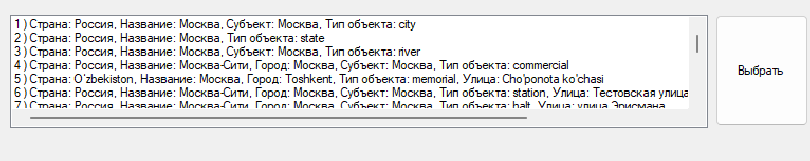

# Логика работы:
* В поле ввода пользователь вводит название чего-то (например "Цветной проезд") и нажимает кнопку поиска;
* Ищутся варианты локаций с помощью метода [1] и показываются пользователю в виде списка;
* Пользователь выбирает одну локацию;
* С помощью метода [2] ищется погода в локации;
* С помощью метода [3] ищутся интересные места в локации, далее для каждого найденного места с помощью метода [4] ищутся описания;
* Всё найденное показывается пользователю.

# Параметры запуска

## Запуск: 
``` bash
    ./NetworkLab3
```
## Выбор места: 
Введите названия места в окошко и нажмите на кнопку выбрать 

Затем выберете определённое место из всплывашки и нажать на кнопку выбрать

После этого вы увидите погоду в этом месте и описание мест рядом
